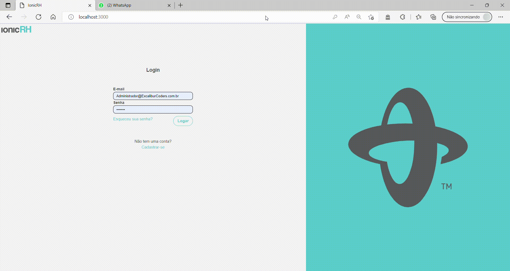
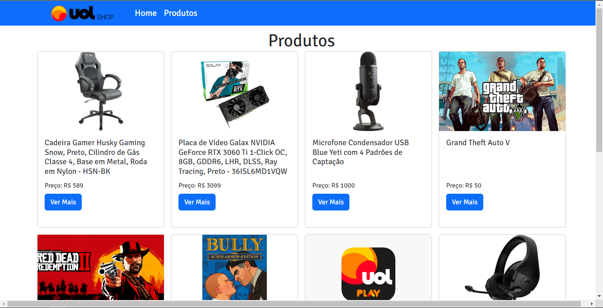
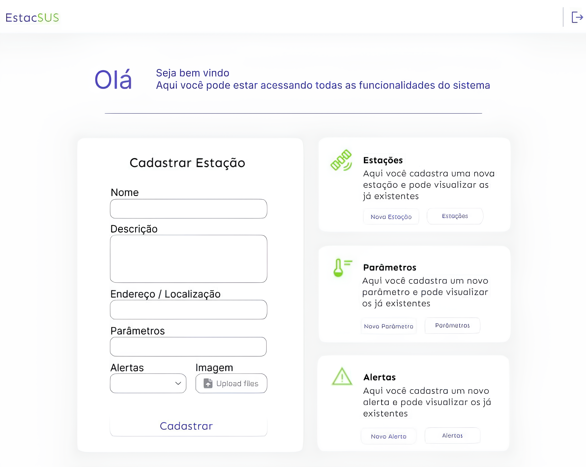
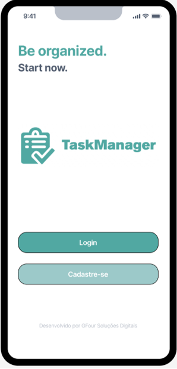
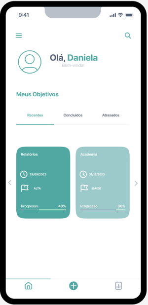
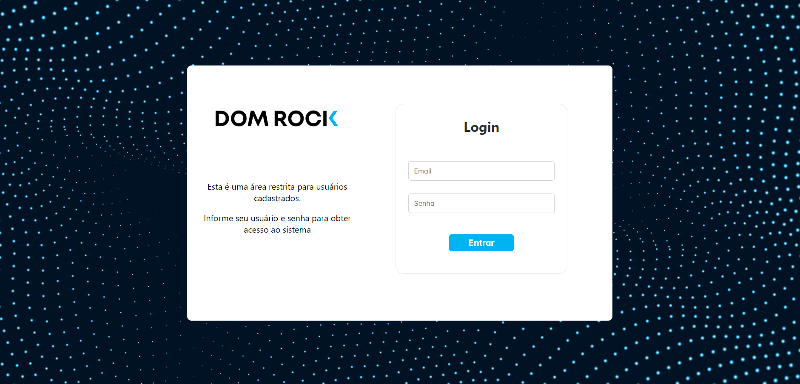
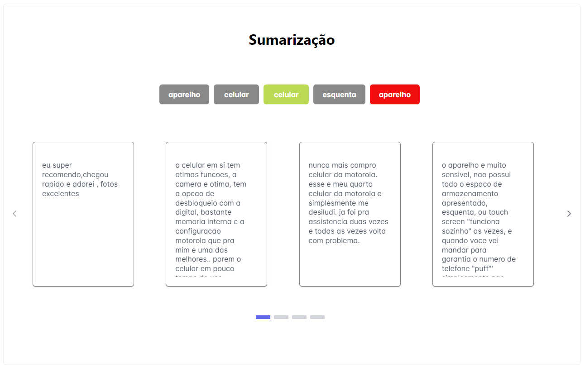

# Kevin Ferreira Mirenda

 <h3 align="left">Sobre Mim </h3>
Olá, meu nome é Kevin Ferreira Mirenda, tenho 20 Anos e estou cursando o 6º semestre de Desenvolvimento de Software Multiplataforma na Fatec. 

<h3 align="left">Minhas Habilidades </h3>

<h4 align="left">Back-end </h4> 

 
 
  

 <h4 align="left">Front-end </h4> 

 
 
 
  
 
 
  

 <h4 align="left">Gerais </h4> 
 
 
 
 
 
 
 

<h3 align="left">Contatos </h3>
  
   &nbsp;&nbsp;&nbsp;  
  
     
     

<h1 align="center">API - Aprendizagem por Projetos Integradores</h1>
  

    <a href="#1semestre">Primeiro Semestre</a> |  
    <a href="#2semestre">Segundo Semestre</a> | 
    <a href="#3semestre">Terceiro Semestre</a> | 
    <a href="#4semestre">Quarto Semestre</a> | 
    <a href="#5semestre">Quinto Semestre</a> | 
    <a href="#6semestre">Sexto Semestre</a> | 

 

<h2 align="center">Primeiro Semestre - Sistema de Divulgação de Informações da FATEC </h2>

<h4 align="left">Objetivo</h4> 
Desenvolver um portal de comunicação alternativo para a FATEC durante a pandemia de COVID-19, visando aliviar a sobrecarga do portal oficial e garantir o acesso contínuo a informações e serviços essenciais para alunos, professores e funcionários.
 

<h4 align="left">Principais Tecnologias</h4>
   

  

  

  

  

  

  <h4 align="left">Aplicação</h4>
    
  &nbsp;&nbsp;&nbsp;
    

<h4 align="left">Link do Repositório</h4>

https://github.com/T3chnogroup/Projeto-InFatec
 
→ [Voltar ao topo](#topo)

 

<h2 align="center">Segundo Semestre - Recursos Humanos e Departamento Pessoal para a Empresa IONIC Health </h2>
<h4 align="left">Objetivo</h4>
O desafio proposto pela Ionic era de desenvolver uma plataforma para apoiar a área de Recursos Humanos e Departamento Pessoal para controle de todos os talentos da empresa (pessoas). Após a aprovação no processo seletivo se faz necessário o cadastro do colaborador (CLT ou PJ) em um sistema que traga informações sobre sua contratação, controle de documentação, dados, entre outros dados. Temos que levar em consideração da LGPD para que o acesso seja restrito. 

 

<h4 align="left">Principais Tecnologias</h4>
  
    
  
    
  
  
 
 

 
  <h4 align="left">Contribuições Pessoais no Projeto</h4>
Neste projeto, eu fiquei focado no Front-end, fazendo algumas telas e integrações com o Back-end
 

<h4 align="left">Aplicação</h4>
  
&nbsp;&nbsp;&nbsp;
  

  
<h4 align="left">Link do Repositório</h4>

https://github.com/excalibur-coders/IONICRH

 

→ [Voltar ao topo](#topo)

 

<h2 align="center">Terceiro Semestre - Cross-selling para a plataforma online da UOL </h2>
<h4 align="left">Objetivo</h4> 
O desafio proposto pela UOL era de desenvolver uma plataforma para incentivar o cross-selling dos produtos e serviços dentro da página de compra, auxiliando no aumento de receita da área de negócio. Com isso, foi firmada a parceria entre a Fatec e a UOL para buscar alternativas disruptivas de cross-selling de produtos e serviços da UOL.

 

<h4 align="left">Principais Tecnologias</h4>

 
 
 
 
  
 

 
  <h4 align="left">Contribuições Pessoais no Projeto</h4>
Neste projeto, fui responsável pelo Design geral da aplicação e desenvolvimento do Front-End. Junto dos outros membros da equipe, fizemos toda a conexão do Back-End com o Front-End.  
Além disso, nesse projeto, atuei como Product Owner (P.O) sendo responsável pelo levantamento e validação de requisitos junto ao nosso cliente. Esse levantamento é primordial, pois com ele é feito o Backlog do Produto, para que a equipe de desenvolvimento possa desenvolver a melhor solução possivel.
 

<h4 align="left">Aplicação</h4>

&nbsp;&nbsp;&nbsp;  
 

  

   
<h4 align="left">Link do Repositório</h4>

https://github.com/Group-NoName

 

→ [Voltar ao topo](#topo)

 

<h2 align="center">Quarto Semestre - Estação Metereológica com a Empresa Tecsus </h2>
<h4 align="left">Objetivo</h4> 
O desafio proposto pela TecSus era de desenvolver uma estação meteorológica. O principal objetivo de criar uma estação meteorológica é coletar dados meteorológicos em tempo real. Esses dados serão coletados por meio de sensores instalados na estação e serão enviados para um servidor na nuvem por meio de uma conexão com a internet. Os dados serão coletados em um tempo determinado e serão disponibilizados para os usuários da estação meteorológica.

 

<h4 align="left">Principais Tecnologias</h4>
 
 
 
 
 
 
 
  <h4 align="left">Contribuições Pessoais no Projeto</h4>
Neste projeto, fui responsável pelo desenvolvimento do Front-end e integração das telas com o Back-end.

 
<h4 align="left">Aplicação</h4>

  

   
<h4 align="left">Link do Repositório</h4>

https://github.com/EquipeGfour/API-4SemestreDSM-EstacaoMeteorologica

 

→ [Voltar ao topo](#topo)

 

<h2 align="center">Quinto Semestre - Task Manager, o aplicativo organizacional para a Oracle Academy </h2>
<h4 align="left">Objetivo</h4>
O desafio proposto pela Oracle Academy era de desenvolver uma aplicação mobile que visa a organização, priorização de tarefas e atribuições diárias, tanto na rotina pessoal quanto no mundo corporativo, priorizando-as por urgência e com marcações de tempo para um controle mais preciso tanto dos objetivos quanto das tarefas, além da mensuração da quantidade de tarefas realizadas e apresentação mensal de resultados de determinado usuário em um dashboard. 

 

<h4 align="left">Principais Tecnologias</h4>
  
 
  
  

 
  <h4 align="left">Contribuições Pessoais no Projeto</h4>
Neste projeto, fiquei focado no Back-end, trabalhando nos CRUDs e outras funcionalidades

 

<h4 align="left">Aplicação</h4>
 
 

 
  

   
<h4 align="left">Link do Repositório</h4>

https://github.com/EquipeGfour/API-5Semestre-OracleAcademy

 

→ [Voltar ao topo](#topo)

 

<h2 align="center">Sexto Semestre - Sistema de Sumarização para a Empresa Dom Rock </h2>
<h4 align="left">Objetivo</h4> 
O objetivo deste projeto é desenvolver um sistema inovador que utiliza inteligência artificial (IA) em linguagem natural para sumarizar automaticamente grandes volumes de comentários de clientes. O sistema irá gerar resumos concisos e informativos, categorizados por diversos critérios relevantes para análise, como produto, categoria, recomendação, geografia e demografia.

 

<h4 align="left">Principais Tecnologias</h4>
  
 
   
   
    

 
  <h4 align="left">Contribuições Pessoais no Projeto</h4>
Neste projeto, assumi o cargo de Scrum Master, onde sou responsável pelo gerenciamento da equipe toda, tanto no controle de tarefas, no auxílio em caso de dificuldades e resolução de possíveis conflitos.
Além disso foquei no Back-end do projeto.

 

<h4 align="left">Aplicação</h4>
  
 
 

  
<h4 align="left">Link do Repositório</h4>

 

https://github.com/EquipeGfour/API-6-Semestre-Dom-Rock

→ [Voltar ao topo](#topo)